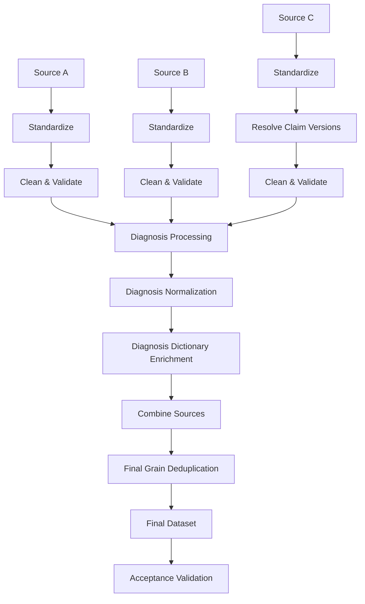

# Design Notes

## 1. Pipeline Overview



Each stage tracks:

```text
Rows In → Rows Out → Dropped → Drop Reason
```

---

## 2. Main Decisions

| Problem Found | Options | What I Chose | Why |
|---|---|---|---|
| Different column names across vendors | Combine directly / Standardize first | **Standardize first** | Same information needs the same field name before combining |
| Source A has 8 diagnosis columns | Keep columns / Convert to rows | **Convert to rows** | Final grain is one row per claim + diagnosis |
| Source C has `I10\|D64.9\|K21.9` | Keep as string / Split into rows | **Split into rows** | Each diagnosis must become a separate record |
| Diagnosis codes have dots/lowercase | Keep original / Normalize | **Uppercase + remove dots** | Required output format and consistent dictionary lookup |
| Source C has multiple claim versions | Keep all / Keep latest | **Keep latest version** | Older versions are superseded records |
| Missing patient ID | Keep / Drop | **Drop** | Required by assignment |
| Date outside required range | Keep / Drop | **Drop** | Required range is 2018-01-01 to 2025-02-28 |
| Different gender formats | Keep vendor format / Normalize | **Normalize to M/F** | One consistent output |
| Code missing from dictionary | Drop code / Keep code without description | **Keep code** | Missing description does not make the claim invalid |
| Duplicate definition | Full-row duplicate / Source + Claim + Diagnosis | **SRC + CLAIM_ID + DIAGNOSIS_CODE** | This is the required final grain |
| Deterministic validation | Run pipeline twice independently / Reuse first output + run once more | **Reuse first output** | Avoids unnecessary first-run processing |

---

## 3. Source Differences

| Field | Source A | Source B | Source C |
|---|---|---|---|
| Patient | `patient_id` | `member_id` | `pt_ref` |
| Claim | `claim_id` | `encounter_id` | `claim_ref` |
| Date | `service_from_date` | `svc_date` | `date_of_service` |
| Diagnosis | 8 columns | 1 column | `\|` separated |
| Gender | M/F | 1/2 | Male/Female |
| ZIP3 | `patient_zip3` | `zip3` | `zip_3` |
| Rendering | `provider_rendering_id` | `rendering_npi` | `npi_rendering` |
| Referring | `provider_referring_id` | `referring_npi` | `npi_referring` |
| Billing | `provider_billing_id` | `billing_npi` | `npi_billing` |
| Primary Plan | `primary_plan_id` | `payer_primary` | `plan_1` |
| Billed Amount | `bill_amt` | `billed_amount` | `amount_billed` |

The first step is therefore to convert these into a common structure.

---

## 4. Source C Version Decision

This was the main unusual behavior I found while inspecting the data.

| Check | Result |
|---|---:|
| Original Source C rows | 24,186 |
| Claims with multiple versions | 3,525 |
| Rows after version resolution | 20,001 |
| Superseded rows removed | 4,185 |

### Decision

```text
24,186 rows
     ↓
Group by claim
     ↓
Keep latest version
     ↓
20,001 rows
```

The removed records are tracked as:

```text
superseded_claim_version
```

I chose this instead of keeping every version because multiple versions represent revisions of the same claim.

---

## 5. Diagnosis Decision

### Source A

```text
diagnosis_code_1
diagnosis_code_2
...
diagnosis_code_8
```

→ Convert columns into diagnosis rows.

### Source B

```text
dx_code
```

→ Directly normalize into `DIAGNOSIS_CODE`.

### Source C

```text
I10|D64.9|K21.9
```

→ Split into:

```text
I10
D649
K219
```

### Common normalization

```text
Trim
 ↓
Uppercase
 ↓
Remove "."
```

Example:

```text
e11.9 → E119
```

---

## 6. Dictionary Decision

| Problem | Options | Decision | Why |
|---|---|---|---|
| Diagnosis code not found in dictionary | Drop / Keep | **Keep** | The claim is still valid |
| Description unavailable | Drop claim / Leave description empty | **Leave empty** | Avoid losing source data |

The dictionary is used only to enrich:

```text
DIAGNOSIS_CODE → DIAGNOSIS_DESC
```

---

## 7. Data Validation Decisions

| Rule | Decision |
|---|---|
| Missing `PATIENT_ID` | Drop |
| Service date before 2018-01-01 | Drop |
| Service date after 2025-02-28 | Drop |
| Gender | Convert to M/F |
| Diagnosis code | Uppercase + no dots |
| Source | SRC_A / SRC_B / SRC_C |
| Final grain | SRC + CLAIM_ID + DIAGNOSIS_CODE |

---

## 8. Problems During Development

| Problem | What I Found | Fix |
|---|---|---|
| `KeyError: dx_code` | Dictionary merge created `dx_code_x` / `dx_code_y` | Made diagnosis-column handling explicit after merge |
| `tuple has no attribute copy` | Source C function returned `(df, tracking)` while caller expected `df` | Updated callers to handle the return values |
| Source C counts were incorrect | Multiple claim versions were being processed | Added separate version-resolution stage |
| Deterministic validation was doing unnecessary work | First output was already available | Reused first output and ran pipeline only once more |

---

## 9. Things I Was Unsure About

| Question | My Decision | What I Would Confirm |
|---|---|---|
| What does Source C `version` mean? | Keep latest version | Confirm with data owner |
| What to do with codes missing from dictionary? | Keep code, empty description | Confirm expected business rule |
| Should missing descriptions fail validation? | No | Confirm if required in production |

---

## 10. Final Result

| Metric | Result |
|---|---:|
| Final rows | 159,704 |
| Distinct claims | 68,205 |
| Distinct patients | 11,963 |
| Distinct diagnosis codes | 44 |
| P00042 total rows | 7 |
| P00042 distinct diagnosis codes | 7 |
| Automated tests | 18 passed |

### Rows by Source

| Source | Rows |
|---|---:|
| SRC_A | 67,531 |
| SRC_B | 52,819 |
| SRC_C | 39,354 |
| **Total** | **159,704** |

---

## 11. What I Would Improve

| Current | If Data Became 100x Larger |
|---|---|
| DataFrames in memory | Chunked/streaming processing |
| Run information in memory | Database-backed run history |
| Local generated CSV | Object storage |
| Synchronous pipeline | Background jobs |
| Basic logging | Structured logging and monitoring |
| Source mappings in code | Configuration-driven mappings |

The current implementation is intentionally kept simple for the assignment data.