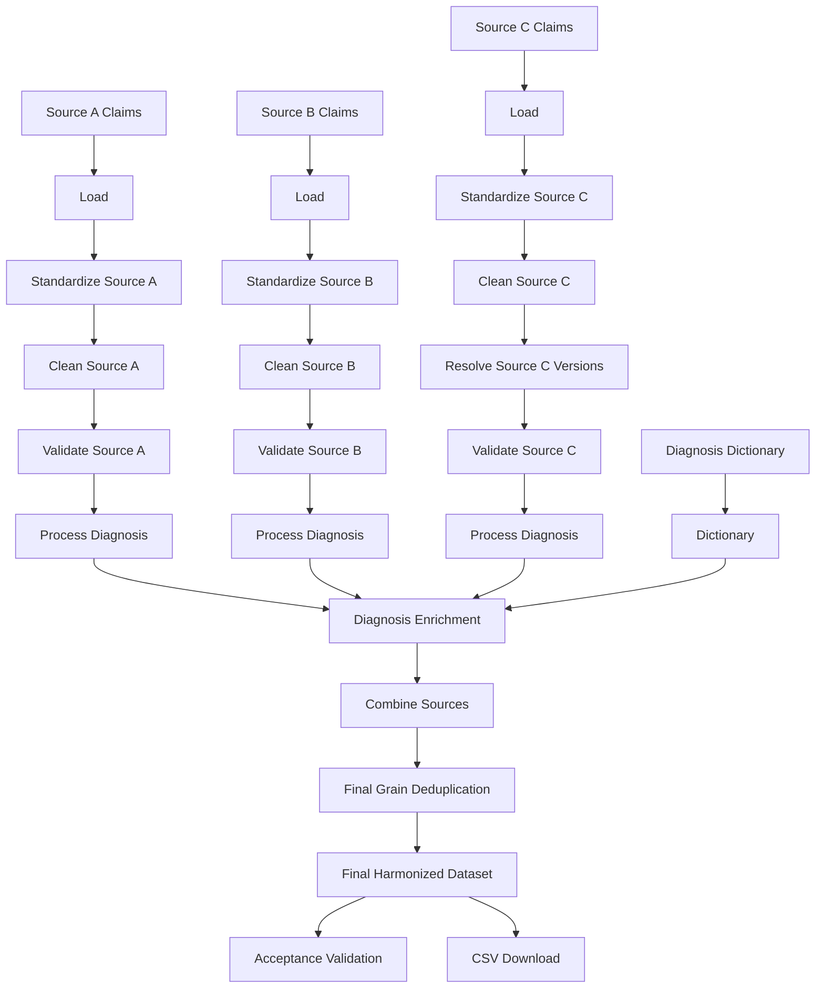
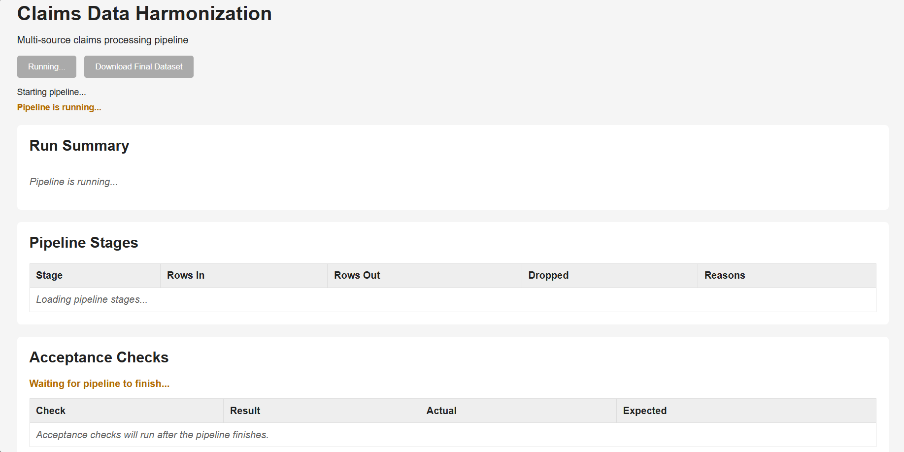
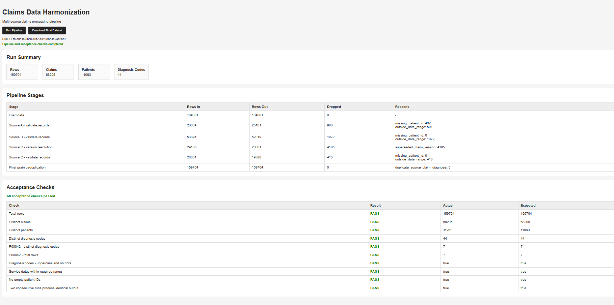

# Multi-Source Claims Data Harmonization Pipeline

## 1. Problem

Three vendors provide claims data with the same type of information, but each vendor uses a different structure.

The differences include:

- Different column names
- Different date formats
- Different gender formats
- Different diagnosis-code formats
- Different provider and plan field names
- Multiple diagnosis columns in one source
- Multiple diagnosis codes in a single field in another source
- Multiple versions of claims in Source C

The goal is to transform all three sources into one clean and consistent claims dataset.

---

## 2. Solution

The pipeline processes each vendor separately, converts the data into a common structure, and then combines the sources.

The main processing includes:

- Standardizing source-specific fields
- Cleaning invalid records
- Filtering the required service-date range
- Removing records without patient IDs
- Resolving Source C claim versions
- Normalizing diagnosis codes
- Converting diagnosis values into individual diagnosis rows
- Adding diagnosis descriptions from the dictionary
- Combining all three sources
- Removing duplicates at the required final grain
- Running acceptance checks

The final grain is:

```text
SRC + CLAIM_ID + DIAGNOSIS_CODE
```

---

## 3. Pipeline


Each pipeline stage records:

```text
Rows In
Rows Out
Dropped
Drop Reasons
```

---

## 4. Running the Application

### Backend

From the project root:

```bash
uvicorn api.main:app --reload
```

Backend:

```text
http://127.0.0.1:8000
```

### Frontend

Open another terminal:

```bash
python -m http.server 5500 --directory frontend
```

Open:

```text
http://127.0.0.1:5500
```

The frontend allows the user to:

- Run the pipeline
- View the run ID
- View pipeline stage counts
- View the run summary
- View acceptance checks
- Download the final dataset

---

## 5. Screenshots

### Pipeline Run



### Acceptance Checks



---

## 6. Design Notes

Detailed design decisions, assumptions, problems encountered, and reasoning are documented separately.

[DESIGN_NOTES.md](DESIGN_NOTES.md)

---

## 7. Final Result

The final pipeline currently produces:

| Metric | Result |
|---|---:|
| Final rows | 159,704 |
| Distinct claims | 68,205 |
| Distinct patients | 11,963 |
| Distinct diagnosis codes | 44 |
| P00042 total rows | 7 |
| P00042 distinct diagnosis codes | 7 |

### Rows by Source

| Source | Rows |
|---|---:|
| SRC_A | 67,531 |
| SRC_B | 52,819 |
| SRC_C | 39,354 |
| **Total** | **159,704** |

---

## 8. Project Structure

```text
claims-data-harmonization/
│
├── analysis/
│   ├── data_profiling.py
├── api/
│   ├── __init__.py
│   └── main.py
│
├── data/
│   ├── source_a_claims.csv.xlsx
│   ├── source_b_claims.csv.xlsx
│   ├── source_c_claims.csv.xlsx
│   └── dx_dictionary.csv.xlsx
│
├── frontend/
│   └── index.html
│
├── pipeline/
│   ├── __init__.py
│   ├── loader.py
│   ├── standardize.py
│   ├── clean.py
│   ├── diagnosis.py
│   ├── enrichment.py
│   ├── combine.py
│   ├── validation.py
│   └── pipeline.py
│
├── tests/
│   ├── test_loader.py
│   ├── test_standardize.py
│   ├── test_clean.py
│   ├── test_diagnosis.py
│   ├── test_combine.py
│   ├── test_validation.py
│   └── test_deterministic.py
│
├── screenshots/
│   ├── pipeline-run.png
│   └── acceptance-check.png
│
├── DESIGN_NOTES.md
├── README.md
├── pytest.ini
└── requirements.txt
```

---
## 9. Test Cases

The project includes automated tests for the main pipeline components.

Run all tests with:

```bash
pytest -q
```

Current result:

```text
18 passed
```

The test cases cover:

- Data loading
- Source standardization
- Data cleaning
- Diagnosis processing
- Diagnosis enrichment
- Source combination
- Final grain validation
- Acceptance validation
- Deterministic pipeline output

---

## 10. Tech Stack

### Backend

- Python
- Pandas
- FastAPI
- Uvicorn

### Testing

- Pytest

### Frontend

- HTML
- CSS
- JavaScript

### Data

- Excel
- CSV output

### Development

- Git
- GitHub
